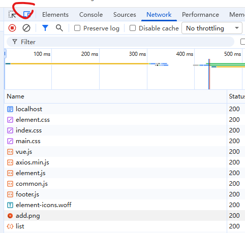

# 相关信息
http://localhost:8081/shop-type/list 来访问测试单独后端是否有问题
测试ngnix
浏览器打开开发者模式F12,选择手机模式，



然后访问： http://localhost:8080/

# BUG

运行时报错：
```java
java: java.lang.NoSuchFieldError: 
Class com.sun.tools.javac.tree.JCTree$JCImport does not have member field 'com.sun.tools.javac.tree.JCTree qualid'

java: java.lang.NoSuchFieldError: 
Class com.sun.tools.javac.tree.JCTree$JCImport does not have member field 'com.sun.tools.javac.tree.JCTree qualid'
```

解决：
File → Project Structure → Project
```yaml
Project SDK: 选择 JDK 1.8
Project language level: 8
```
修改模块 SDK
File → Project Structure → Modules → 右边选择 hmdp 模块 → Dependencies
```yaml
Module SDK: JDK 1.8
```
IDEA Maven Runner 设置
Settings → Build Tools → Maven → Runner
```yaml
JRE = Project JDK（选择 JDK 1.8）
```

